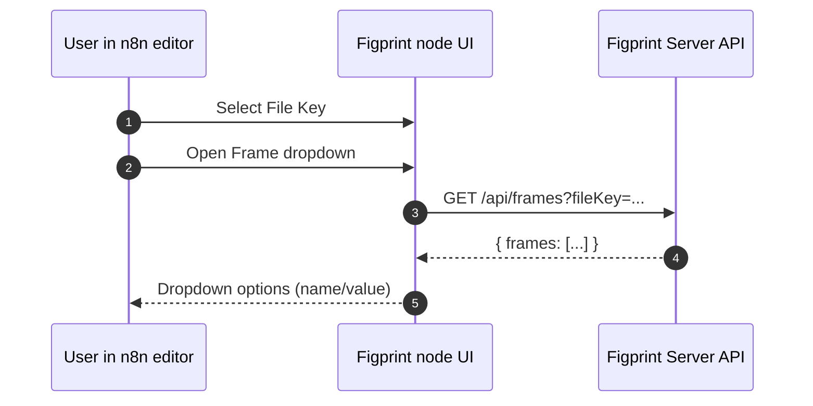

# n8n-nodes-figprint

n8n community node for the Figprint Server API.

## Installation
Follow the n8n community node installation guide:
<https://docs.n8n.io/integrations/community-nodes/installation/>

## Credentials
Create a credential of type **Figprint API**.

Notes:
- Configure **Base URL** for your Figprint instance (self-hosted or 3rd-party cloud).
- Configure **API Token** if your server requires it (sent as `Authorization: Bearer <token>`).
- Optionally set **Default X-Figma-Token** (can be overridden per operation).

## Node: Figprint

Note on workflow:
- Use **Generate** operations when you want server-side generation using just a `fileKey` (and optional `frame`). This does **not** require a `previewId`.
- Use **Preview → Live Preview** when you need a `previewId` for exporter pipelines and (non-label) exports; **Export (GET)** / **PDF (Wrapper)** and **Export (POST)** for `kind=pdf|png|html` require `previewId` on the FigPrint side for multi-tenant isolation.
- **Label** generation (Label → Generate Label, or Export → Export (POST) with `kind=label`) does not use `previewId`.

### Parameters

**Resource**
- `Frame`
- `Preview`
- `Export`
- `Generate`
- `Label`
- `Font`
- `Status`

**Operation**
- `List Frames`
- `Get Starter Payload`
- `Live Preview`
- `Get Preview HTML`
- `Export`
- `Export (POST)`
- `PDF (Wrapper)`
- `Generate (Single)`
- `Generate Multi`
- `Generate Label`
- `List Fonts`
- `Font Debug`
- `Get Status`
- `Get Config`

**File Key**
- Figma file key.

**Frame**
- Frame identifier/name (where applicable).
	- Used by Preview → Live Preview and Generate → Generate (Single).
	- Required for Label → Generate Label and Export → Export (POST) when `kind=label`.
	- If **File Key** is set, the dropdown will populate from Frames → List Frames.

**Preview ID** (Preview only)
- Used by Preview → Get Preview HTML.

**Merge Payload (JSON)** (Preview only)
- Optional object merged into the preview.

**Structured Payload (JSON)** (Preview only)
- Optional structured payload object.

**Pages Spec (JSON)** (Preview only)
- Optional array describing pages.

**Preview ID** (Export only)
- Preview ID returned by Preview operations.

**Kind** (Export only)
- `pdf` | `png` | `html`

**Kind** (Export → Export (POST))
- `pdf` | `png` | `html` | `label`

**Filename** (Export only)
- Optional output filename (without extension).

**Backend** (Export only, PDF kind)
- `weasyprint` | `krilla` (optional)

**Export Body (JSON)** (Export → Export (POST), non-label kinds)
- Optional JSON body for exporters that accept a POST body (future-proofing).

**Label inputs** (Export → Export (POST), kind = `label`)
- Same inputs as Label → Generate Label: `Label Format`, `File Key`, `Frame`, `DPI`, `Missing`, `Merge (JSON)`.

**Generate inputs**
- Generate (Single): `File Key`, optional `Frame`, `Payload (JSON)`.
- Generate Multi: `File Key`, optional `Pages (JSON)`, `Order (JSON)`, `Duplicates (JSON)`, `Merge Payloads (JSON)`, `Missing`.

### TODO (FigPrint)

To support a dynamic dropdown of available export kinds/plugins in n8n (instead of a fixed list), FigPrint would need to expose this via its API (for example `GET /api/exporters` returning available `kind` values; optionally `GET /api/plugins` for payload/content plugins). Today, `/api/status` only provides capability hints like `render.pngAvailable`.

### Options

**Hard Refresh**
- Boolean flag to request frames with a hard refresh where supported.

**X-Figma-Token**
- Optional per-request override for the Figma token (`X-Figma-Token` header).

Preview options:
- **Mask Text**
- **Font Debug**
- **Reverse Order**
- **Plugin Debug**

Status options:
- **Diag** (Status → Get Status only)

### Output
Frames → List Frames returns JSON.

Frames → Get Starter Payload returns JSON:
- `json.fileKey`
- `json.starterPayload`

Preview → Live Preview returns JSON:
- `json.html`: HTML string returned by the server
- `json.previewId`: value of the `X-Preview-ID` response header (if present)

Preview → Get Preview HTML returns JSON:
- `json.previewId`
- `json.html`

Export → Export returns binary:
- `binary.data`: the exported file
- `json.kind`, `json.previewId`, `json.filename`, `json.contentType`

Export → PDF (Wrapper) returns binary:
- `binary.data`: PDF
- `json.previewId`, `json.filename`, `json.contentType`

Label → Generate Label returns binary:
- `binary.data`: label text (`text/plain`)
- `json.format`, `json.fileKey`, `json.frame`, `json.dpi`, `json.missing`, `json.filename`

Generate → Generate (Single) returns JSON:
- `{ status: "ok" }`

Generate → Generate Multi returns JSON:
- `{ status: "ok" }`

Export → Export (POST) returns binary:
- For `kind=pdf|png|html`: same shape as Export → Export.
- For `kind=label`: same shape as Label → Generate Label.

Fonts → List Fonts returns JSON.

Fonts → Font Debug returns JSON.

Status → Get Status returns JSON.

Status → Get Config returns JSON.

## Examples

## Flow diagrams (Mermaid)

### Preview → Export (PDF/PNG/HTML) using `previewId`

```mermaid
flowchart LR
	A[Upstream data
(Set/HTTP/Webhook/etc)] --> B[Figprint
Resource: Preview
Operation: Live Preview]
	B -->|outputs json.previewId| C[Figprint
Resource: Export
Operation: Export]
	C -->|binary.data| D[Next step
(S3/Email/Glide/etc)]

	B -. optional .-> E[Figprint
Resource: Preview
Operation: Get Preview HTML]
```

### Label generation (no `previewId`)

```mermaid
flowchart LR
	A[Upstream data
(Set/HTTP/Webhook/etc)] --> B[Figprint
Resource: Label
Operation: Generate Label]
	B -->|binary.data (text/plain)| C[Next step
(Print/Store/Attach)]

	A --> B2[Figprint
Resource: Export
Operation: Export (POST)
Kind: label]
	B2 -->|binary.data (label text)| C
```

### Server-side Generate (returns JSON status)

```mermaid
flowchart LR
	A[Upstream data
(Set/HTTP/Webhook/etc)] --> B[Figprint
Resource: Generate
Operation: Generate (Single)]
	A --> C[Figprint
Resource: Generate
Operation: Generate Multi]

	B --> D[Downstream logic
(IF/Switch/Writeback)]
	C --> D
```

### Frames dropdown / load options



### Preview → Export (PDF) using `previewId`
1) Figprint node: **Resource** = `Preview`, **Operation** = `Live Preview`
2) Next Figprint node: **Resource** = `Export`, **Operation** = `Export`
	 - **Kind** = `pdf`
	 - **Preview ID** = `{{$json.previewId}}`

### Single-frame merge payload
In **Preview → Live Preview**, set **Merge Payload (JSON)**:
```json
{
	"name": "Samuel Pull",
	"orderId": "12345"
}
```

### Structured payload example
In **Preview → Live Preview**, set **Structured Payload (JSON)**:
```json
{
	"page1": {
		"title": "Hello",
		"subtitle": "World"
	}
}
```

## Roadmap
Roadmap/backlog is maintained in the repository.

## Ideal API (proposed): single-step `generate` returns a file

Today, PDF/PNG/HTML exports are typically a two-step flow in n8n:
1) **Preview → Live Preview** (returns `previewId`)
2) **Export** (downloads the binary)

This works well, but the UX is clunky for common automation cases where you just want:
**template/fileKey + payload + output kind → binary file**.

### Proposed endpoint

**Goal:** a single endpoint that renders and returns the final artifact (PDF/PNG/HTML/label) in one request.

`POST /api/generate`

#### Request (suggested)

```json
{
	"fileKey": "c1hHGLYqSb7WmBynG7sIJd",
	"frame": "optional-frame-id-or-name",

	"kind": "pdf",
	"labelFormat": "zpl",
	"dpi": 203,

	"missing": "keep",
	"payload": { "...": "merge fields" },
	"structuredPayload": { "...": "optional structured input" },
	"pagesSpec": [ { "frameID": "1", "...": "optional per-page overrides" } ]
}
```

**Notes**
- `kind`: `pdf | png | html | label`
- For `kind=label`, `labelFormat` + `dpi` apply.
- `payload` should cover the existing merge payload use case.
- `structuredPayload` and `pagesSpec` mirror what the Preview API already supports.

#### Response (suggested)

- Success returns raw bytes with a correct `Content-Type`:
	- `application/pdf` for `pdf`
	- `image/png` for `png`
	- `text/html; charset=utf-8` for `html`
	- `text/plain; charset=utf-8` for `label`
- Optional headers:
	- `Content-Disposition: attachment; filename="<name>.<ext>"`
	- `X-Preview-Id: <id>` (useful for debugging/cache hits)

#### Error response (suggested)

Return JSON errors with HTTP status codes:

```json
{ "error": "BadRequest", "message": "Missing fileKey" }
```

### How this maps to the current n8n node

With this endpoint available, the n8n node could expose a single operation like:
**Render (One Step)**

Under the hood it would either:
- Call the new single-step endpoint directly, or
- (Fallback) do the current two-step **Preview → Export** flow for older servers.


## License
MIT


